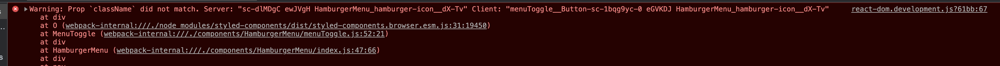

### Portfolio (NextJS x Contentful)

> To run: `npm run dev`

### Background

This is a rework of my personal portfolio using NextJS and Contentful as headless CMS. It includes both a personal blog of writings to record knowledge retained from work and extra-curricular study, and my previous freelance illustrative work.

A number of future expansion opportunities have been identified on this boilerplate format, which includes:
* more advanced animation with `framer-motion` and `intersection observer` such as slide into view
* tracking currently active links
* changing the visual look of the keys on the piano when pressed
* more advanced animation for the decorative background symbols on the homepage banner
* using a different photo gallery or lightbox npm package to achieve a smoother, slicker look for the illustration images

This project presented an excellent opportunity to practice reactJS as well as venturing into nextJS framework.

A webhook has been deployed so that any content changes on the contentful side will trigger a full redeploy. This is considered appropriate as it is unlikely the portfolio will undergo any major/minor changes frequently.

#### Unresolved issues

The deployed site has gone through a number of tests with the Chrome Lighthouse report, W3C Html validator service and CSS validator service. Effort has been made towards eliminating those errors but some still persist. It is suspected that these errors come about from some of the npm packages installed, specifically `react-photoswipe-gallery`, `react-slick`, `slick-carousel`. The errors are specifically towards alt text for images and 
 and  nesting order.

A persistent error is also displayed when the site runs on `localhost` but not found on the deployed version. This error come about from using `styled-components` npm package with nextJS. A babel compiler package had been added as per this [link](https://binyamin.medium.com/solving-the-styled-components-warning-in-next-js-with-babel-83080e45a0ff).

### Helpful links

* rendering code snippets from contentful
https://www.christiancoda.com/blog/code-snippets-with-contentful/

https://stackoverflow.com/questions/64191373/how-to-add-code-block-for-code-snippets-for-in-the-data-displays-in-the-react-ho

* wrapping code snippets with <pre></pre> https://stackoverflow.com/questions/57149824/how-to-format-code-snippets-with-pre-tags-using-contentfuls-rich-text-react-r

* framer motion text reveal https://brad-carter.medium.com/how-to-animate-a-text-reveal-effect-in-react-with-framer-motion-ae8ddd296f0d (interestingly emojis doesn't work with this)

* https://github.com/vercel/next.js/discussions/12810 extra module import in `next.config.js` to import sound into nextJS